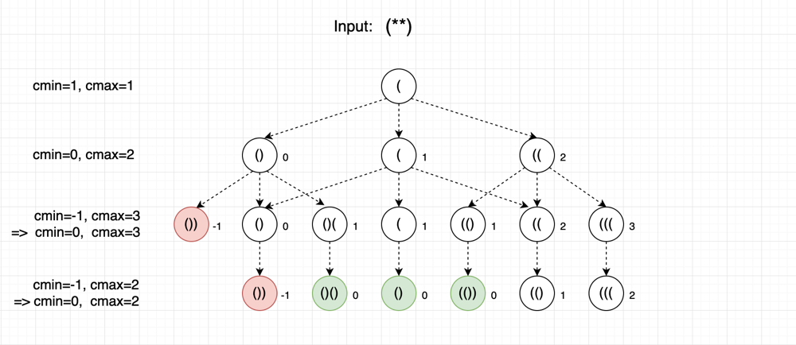

# Problem

- [문제 링크](https://leetcode.com/problems/valid-parenthesis-string/)

<br>

`(, ), *` 로 이루어진 `String` 이 주어지면 이 문자열이 *__Valid Parenthesis__* 을 이루는지 확인하는 문제입니다.

여는 괄호와 닫는 괄호가 정확히 쌍을 이루고 순서가 일치한 경우 Valid 한 문자열 입니다.

별 * 는 `(` 또는 `)` 또는 `empty string` 으로 치환 할 수 있습니다.

<br><br>

# Solution 1

백트래킹을 이용하여 구할 수 있지만 * 가 총 세 가지 케이스로 나뉘기 때문에 O(3<sup>n</sup>) 의 시간복잡도를 가집니다.

문자열의 최대 길이가 100 이기 때문에 시간이 굉장히 오래걸립니다.

<br><br>

# Java Code 1

```java
class Solution {
    public boolean checkValidString(String s) {
        return backtracking(s, 0, 0);
    }
    
    private boolean backtracking(String s, int index, int count) {
        if (index == s.length()) {
            return count == 0;
        }
        
        if (count < 0) {
            return false;
        }
        
        switch (s.charAt(index)) {
            case '(':
                return backtracking(s, index + 1, count + 1);
            case ')':
                return backtracking(s, index + 1, count - 1);
            default:
                return backtracking(s, index + 1, count - 1) || 
                       backtracking(s, index + 1, count)     || 
                       backtracking(s, index + 1, count + 1);
                
        }
    }
}
```

<br><br><br>

# Solution 2

다른 방법을 생각하지 못하다가 결국  **_Discuss_** 를 보았습니다. [그림 출처](https://leetcode.com/problems/valid-parenthesis-string/discuss/543521/Java-Count-Open-Parenthesis-O(n)-time-O(1)-space-Clean-Explain)

<br>



<br>

`O(n)` 시간복잡도와 `O(1)` 공간복잡도의 풀이가 처음에는 이해가 안되었는데 그림과 코드를 같이 보다보니 이해되었습니다.

우선 `minC` 와 `maxC` 를 선언합니다.

C 는 단순히 `(` 와 모양이 비슷해서 임의로 선언한겁니다.

네이밍에서 알 수 있듯이 `(` 의 최대값과 최소값을 각각의 변수에 저장하는 겁니다.

<br>

1. `(` 를 만나면 `maxC` 와 `minC` 를 둘다 증가 시킨다.
2. `)` 를 만나면 `maxC` 와 `minC` 를 둘다 감소 시킨다.
3. `*` 를 만나면 `maxC` 는 증가시키고 ( `(` 로 치환) `minC` 는 감소 시킨다. ( `)` 로 치환)
4. `maxC` 가 0 보다 작아지면 Valid 한 상태가 아니므로 `false` 다. ex - `)(`
5. `minC` 가 0 보다 작아지면 `)` 로 치환했던 거 하나를 `(` 으로 바꾼다.

<br>

`maxC` 가 0 이상이라면 `minC` 를 최소 0 으로 유지할 수 있다.

마지막으로 `minC` 가 0 이라면 `true` 를 리턴한다.

<br><br>

# Java Code 2

```java
class Solution {
    public boolean checkValidString(String s) {
        int minC = 0;
        int maxC = 0;
        
        for (char c : s.toCharArray()) {
            if (c == '(') {
                maxC++;
                minC++;
            } else if (c == ')') {
                maxC--;
                minC--;
            } else {
                maxC++;
                minC--;
            }
            
            if (maxC < 0) return false;
            if (minC < 0) minC = 0;
        }
        
        return minC == 0;
    }
}
```
