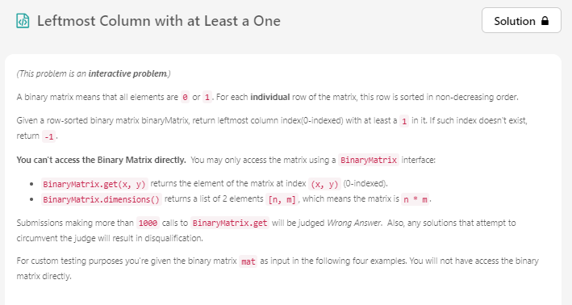
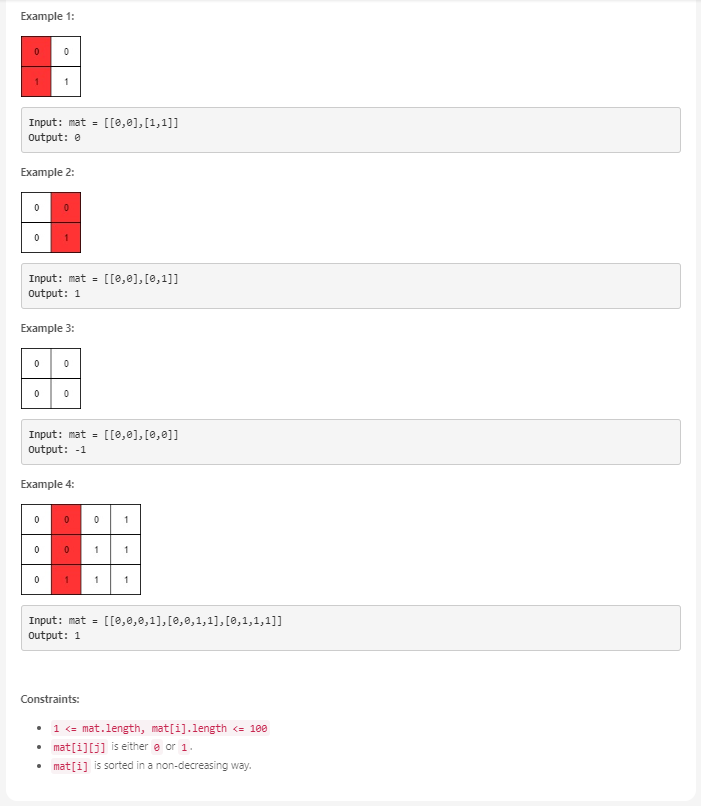

# Problem




<br>

0 과 1 로만 이루어진 이진 매트릭스가 주어집니다.

1 의 갯수가 최소인 가장 왼쪽 컬럼을 찾는 문제입니다.

<br><br>

# Solution 1

이진 탐색으로 `O(n * log n)` 시간복잡도에 풀 수 있습니다.

1 의 갯수는 `O(n)` 으로 전부 스캔하여 찾고 최소 컬럼은 이진 탐색으로 `O(log n)` 으로 찾습니다.

<br><br>

# Java Code 1

```java
class Solution {
    public int leftMostColumnWithOne(BinaryMatrix binaryMatrix) {
        List<Integer> dimension = binaryMatrix.dimensions();
        int n = dimension.get(0);
        int m = dimension.get(1);
        
        int lo = 0;
        int hi = m-1;
        
        while (lo <= hi) {
            int mid = (lo + hi) / 2;
            int count = countOne(binaryMatrix, mid, n);
                        
            if (count == 0) {
                lo = mid + 1;
            } else {
                hi = mid - 1;
            }
        }
        
        return lo < m ? lo : -1;
    }
    
    private int countOne(BinaryMatrix binaryMatrix, int col, int n) {
        int count = 0;
        
        for (int i=0; i<n; i++) {
            count += binaryMatrix.get(i, col);
        }
        
        return count;
    }
}
```

<br><br><br>

# Solution 2

**Discuss** 보니까 `O(N * M)` 풀이가 있었습니다.

기본적인 아이디어는 1 의 갯수가 왼쪽 컬럼으로 갈수록 무조건 작아지므로 우측 상단부터 시작하여

1 을 만날때까지 아래로 내려오면서 1 을 만나면 왼쪽으로 이동합니다.

그 뒤 맨 아래까지 내려왔을 때 위치한 `col` 이 **1 이 하나도 없는 가장 우측에 있는 컬럼**입니다.

그러므로 `col + 1` 인 컬럼이 1 을 갖고 있으면서 가장 왼쪽에 위치한 컬럼이 됩니다.

<br><br>

# Java Code 2

```java
class Solution {
    public int leftMostColumnWithOne(BinaryMatrix binaryMatrix) {
        List<Integer> dimension = binaryMatrix.dimensions();
        int n = dimension.get(0);
        int m = dimension.get(1);
        
        int row = 0;
        int col = m - 1;
        int count = 0;
        
        while (row < n && col >= 0) {
            if (binaryMatrix.get(row, col) == 0) {
                row++;
            } else {
                col--;
            }
        }
        
        col++;
        
        return col < m ? col : -1;
    }
}
```