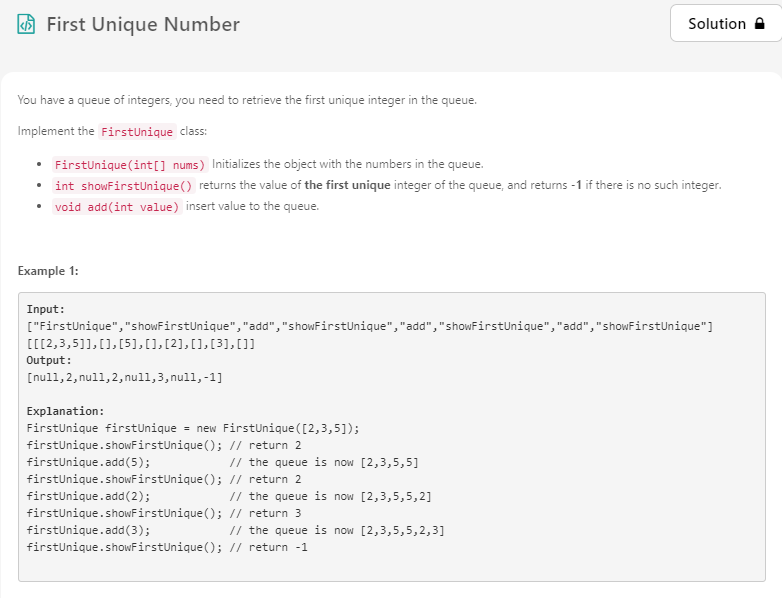
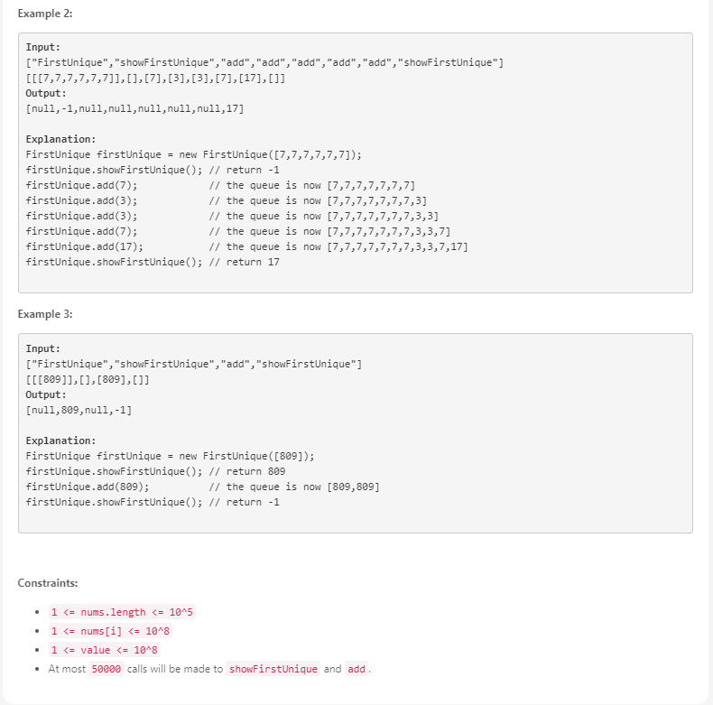

# Problem




<br>

`FirstUnique` 자료구조를 구현하는 문제입니다.

<br>

Method | Description
------ | ----------
FirstUnique(int[] nums) | 자료구조 선언, 파라미터로 받은 `nums` 배열의 값들을 갖는다.
int showFirstUnique()   | 이 자료구조에 있는 가장 먼저 들어온 유일한 숫자를 리턴한다.
void add(int value)     | 새로운 값을 추가한다.

<br>

**Unique** 숫자들이란 두 번 이상 `add` 되지 않은 `value` 를 의미합니다.

<br><br>

# Solution

`HashSet` 과 `LinkedHashSet` 을 이용하여 문제를 해결할 수 있습니다.

`all` Set 은 지금까지 `add` 된 모든 값들을 저장합니다.

`unique` Set 은 현재 **Unique** 한 값들만 갖고있습니다.

`unique` 는 `LinkedHashSet` 이기 때문에 가장 앞에 있는 값이 처음 들어온 값입니다.

`unique.iterator().next()` 값을 리턴하면 간단한게 `showFirstUnique()` 메소드를 구현할 수 있습니다.

`add(value)` 가 호출되면 `all` 안에 이미 값이 들어있는지 아닌지 확인합니다.

값이 들어있다면 과거에 한번이라도 들어왔던 값이기 때문에 `unique` Set 에서 삭제합니다.

만약 새로운 값이라면 두 Set 에 각각 추가해줍니다.

선언은 `O(n)`, `showFirstUnique()` 와 `add(int value)` 는 `O(1)` 시간복잡도를 갖습니다.

<br><br>

# Java Code

```java
class FirstUnique {
    Set<Integer> all = new HashSet<>();
    Set<Integer> unique = new LinkedHashSet<>();
    
    public FirstUnique(int[] nums) {
        for (int num : nums) {
            add(num);
        }
    }
    
    public int showFirstUnique() {
        return unique.isEmpty() ? -1 : unique.iterator().next();
    }
    
    public void add(int value) {
        if (all.contains(value)) {
            unique.remove(value);
        } else {
            unique.add(value);
            all.add(value);
        }
    }
}
```