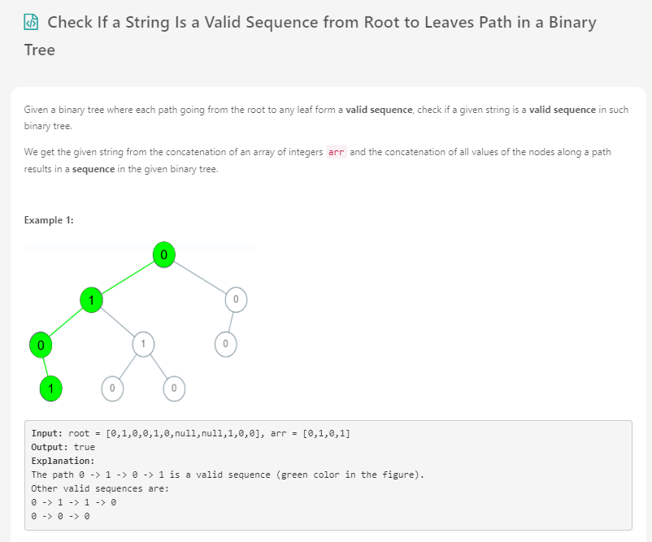
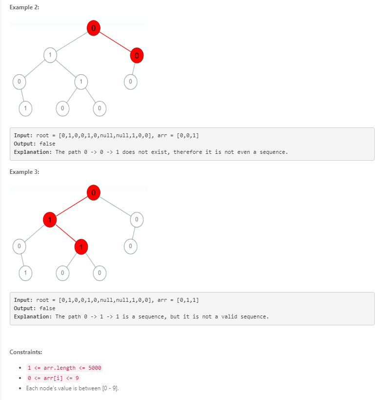

# Day 30 - Check If a String Is a Valid Sequence from Root to Leaves Path in a Binary Tree

 

User  | Submission | Language
:--:  | :--------: | :-----:
woody | O          | [Java](./woody.md)
puyo | O          | [cpp](./puyo.cpp)