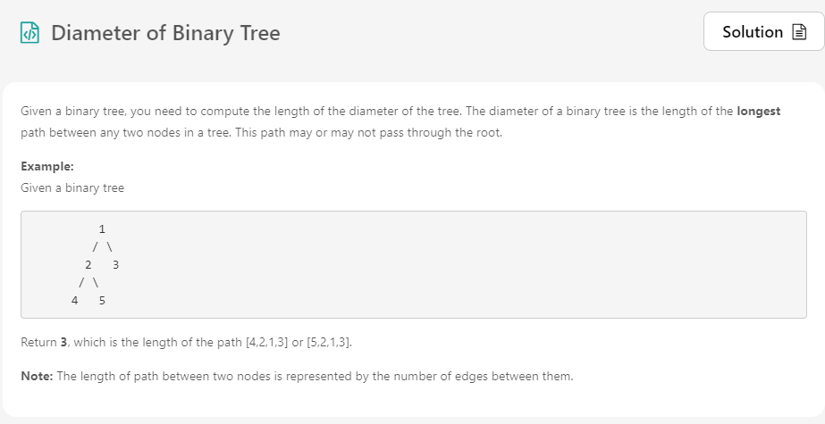

# Problem



<br>

특정 노드를 기준으로 왼쪽, 오른쪽 깊이의 합 을 구하면 됩니다.

특정 노드는 루트 노드가 될 수도 있지만 아닐 수도 있습니다.

깊이의 합 중 가장 큰 값을 리턴합니다.

<br><br>

# Solution

구하려는 `max` 값은 전역변수로 선언합니다.

재귀를 이용하여 `node == null` 이 될 때까지 호출합니다.

`getDepth` 함수에서 리턴할 때마다 +1 을 해준다면 호출한 노드에서 깊이를 구할 수 있습니다.

현재 노드를 기준으로 `max` 값을 계산한 뒤, 리턴할 때는 왼쪽 깊이와 오른쪽 깊이 중 더 긴 값을 부모 노드에게 전달합니다.

모든 노드에 대해 수행해주면 `max` 값이 구해집니다.

노드 개수 `N` 에 대해서 `O(N)` 시간복잡도를 가집니다.

<br><br>

# Java Code

```java
class Solution {
    int max = 0;
    
    public int diameterOfBinaryTree(TreeNode root) {
        getDepth(root);        
        return max;
    }
    
    public int getDepth(TreeNode node) {
        if (node == null) return 0;
        
        int left = getDepth(node.left);
        int right = getDepth(node.right);
        
        max = Math.max(max, left + right);
        
        return Math.max(left, right) + 1;
    }
}
```