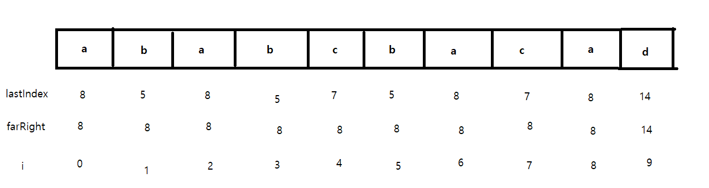

# Problem

- [문제 링크](https://leetcode.com/problems/partition-labels/)

<br>

Medium 문제입니다.

주어진 문자열 `S` 를 나누었을 때 각 파트는 다른 파트와 중복된 문자가 없어야 합니다.

예를 들어 a, b, c 세 파트로 나눈다면 a 파트에 존재하는 문자는 b, c 파트에 존재하지 않아야 합니다.

위 조건을 만족하면서 최대한 많은 파트로 쪼갰을 때 각각의 길이를 `List` 에 담아 리턴하면 됩니다.

<br><br>

# Solution

`for` 문을 총 두번 돕니다.

첫 번째 `for` 문에서는 각 문자들이 마지막으로 등장하는 `index` 를 저장해둡니다.

두 번째 `for` 문에서는 현재 지나고 있는 문자들 중 가장 마지막에 나오는 문자의 `index` 를 저장해둔 뒤 `i` 가 그 `index` 에 도달했을 때, 더 이상 중복되는 문자는 나오지 않는다고 판단하여 길이를 저장합니다.

<br>



주어진 문자 `"ababcbacadefegdehijhklij"`  로 예를 들면 

`"ababcbaca"` 문자열이 진행되는 동안 `farRight` 변수는 8 입니다.

마지막 `'a'` 를 만나는 순간 `i == farRight` 가 되고 **지금까지 나온 문자들은 이후에는 절대 나오지 않는다** 라는 걸 알 수 있습니다.

리스트에 `start` 부터 `farRight` 까지의 길이를 넣어두고 다음 문자부터 다시 위 과정을 반복하면 됩니다.

<br><br>

# Java Code

```java
class Solution {
    public List<Integer> partitionLabels(String S) {
        int[] lastIndexs = new int[26];

        for (int i = 0; i < S.length(); i++) {
            lastIndexs[S.charAt(i) - 'a'] = i;
        }
        
        List<Integer> list = new ArrayList<>();
        int start = 0;
        int farRight = 0;
        
        for (int i = 0; i < S.length(); i++) {
            farRight = Math.max(farRight, lastIndexs[S.charAt(i) - 'a']);
            
            if (i == farRight) {
                list.add(farRight - start + 1);
                start = i + 1;
            }
        }
        
        return list;
    }
}
```
